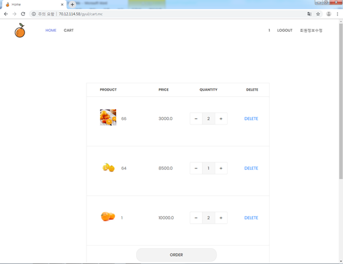

# Gyul Farm

> 스프링 프레임워크 기반 쇼핑몰 구현

## 기능

- 회원가입 / 탈퇴
  - 정규식 적용
- 회원 로그인 / 로그아웃
- 관리자 제품 CRUD
- 회원 장바구니 기능
- 회원 주문기능 

## 활용 스택

| 구분 | 스택                                                  |
| ---- | ----------------------------------------------------- |
| Web  | `HTML5`, `CSS3`, `JavaScript`, `jQuery`               |
| WAS  | `Java`,  `Spring Framework`,  `Mybatis`, `Tomcat 9.0` |
| DB   | `Oracle 11g`                                          |

## 구성

## 구현 화면

### 메인

### 회원가입

### 제품 디테일

### 주문

### 카트

### 카트 > 주문

### 관리자 모드

> Admin_login

### 제품 등록

> Create

### 제품 리스트

> Read|Update|Delete

